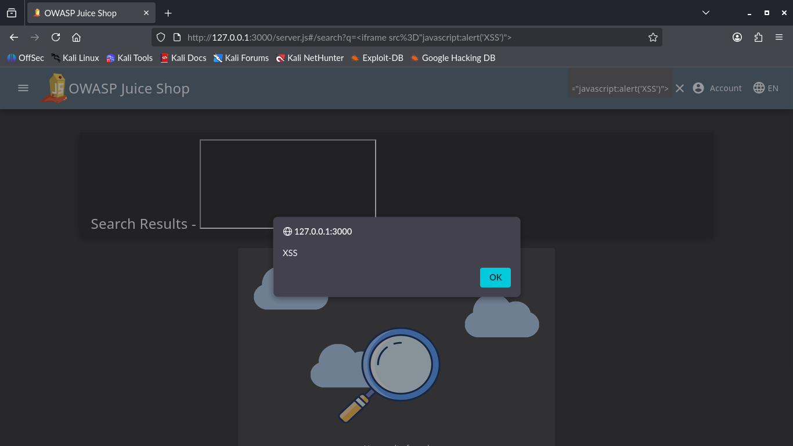

# ADVANCED 03: Reflected XSS (DOM-Based)

## Goal
Identify and exploit a **Cross-Site Scripting (XSS)** vulnerability in the search functionality to execute arbitrary JavaScript code in the user's browser.

## Methodology
The attack was performed manually using the browser. The application reflects user input from the search bar directly into the DOM without proper sanitization.

### Key Steps
1.  **Target:** The main product search bar.
2.  **Payload:** Injected an HTML `<iframe>` element executing JavaScript.
    * Payload: `<iframe src="javascript:alert('XSS')">`
3.  **Observation:** The application rendered the HTML tag, causing the browser to execute the alert function immediately.

---

## Key Findings

### 1. Lack of Input Sanitization
The application fails to strip dangerous HTML tags from the search query before displaying it to the user.

### 2. Impact
* **Severity:** High
* **Risk:** An attacker could craft a malicious link containing this payload. If a victim clicks it, the attacker could steal session cookies (Account Takeover), redirect the user to a phishing site, or perform actions on their behalf.

### 3. Bonus Finding: Click-Triggered XSS (Evasion)

To prove a more sophisticated attack, a second payload was executed that avoided immediate execution and required user interaction (a click) to fire. This simulates a successful phishing or social engineering attack.

* **Payload Used:** `<a href="javascript:alert('DOM XSS')">CLICK ME FOR A PRIZE</a>`
* **Result:** The payload successfully rendered as a link on the search results page, and the malicious JavaScript only executed upon user click.

* **Significance:** Proves the ability to craft evasive payloads and control the timing of script execution.

---
