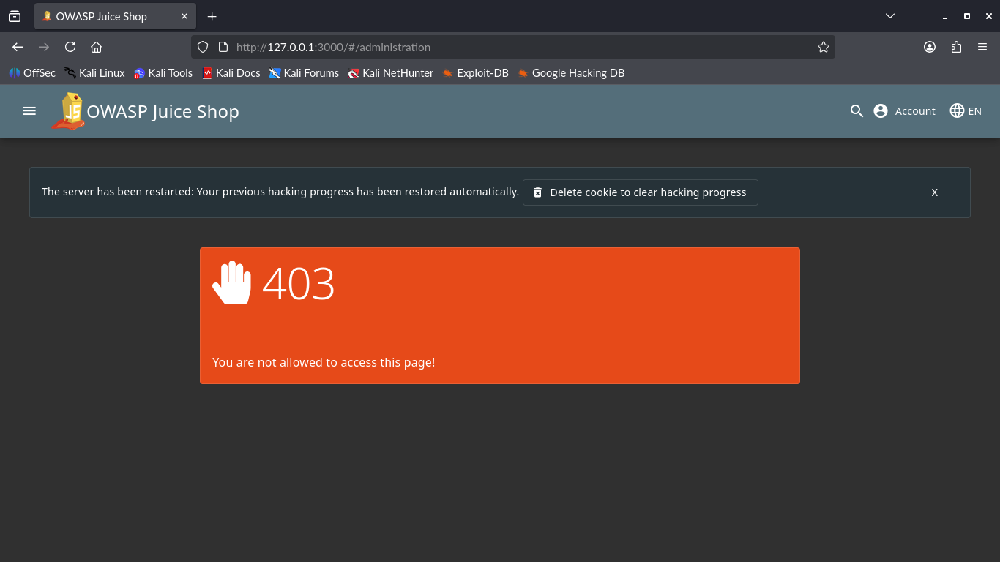
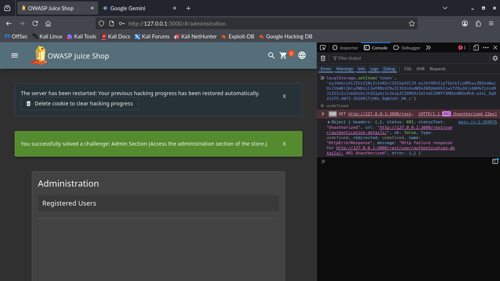

# ADVANCED 04: Broken Access Control (Client-Side Token Manipulation)

## Goal
Identify a hidden Administration Panel and bypass client-side access control mechanisms to gain unauthorized access as an Administrator.

## Methodology
The attack targeted the application's **JSON Web Token (JWT)**, which is stored in the browser's `localStorage` and used to determine a user's role.

### Key Steps
1.  **Discovery:** Located the unlinked Administration panel URL: `/#/administration`.
2.  **Initial Check:** Access was blocked with a **403 Forbidden** error, indicating a client-side role check was present.

3.  **Exploitation:** Used the Developer Console to overwrite the valid standard user token with a known, pre-generated JWT that contained the elevated role: `"role": "admin"`.
4.  **Confirmation:** Navigating to the hidden URL immediately displayed the full Administration Dashboard, confirming the bypass.

---

## Key Findings

### 1. Client-Side Access Control (A01)
The application relies solely on the integrity of the JWT token in local storage to enforce access control within the browser, rather than performing a server-side check before rendering sensitive UI elements.

### 2. Impact
* **Severity:** **High**
* **Risk:** Any standard user who can read or write to their browser's local storage can instantly elevate their privileges to Administrator, enabling them to view user lists, manage products, and potentially delete data.

---
