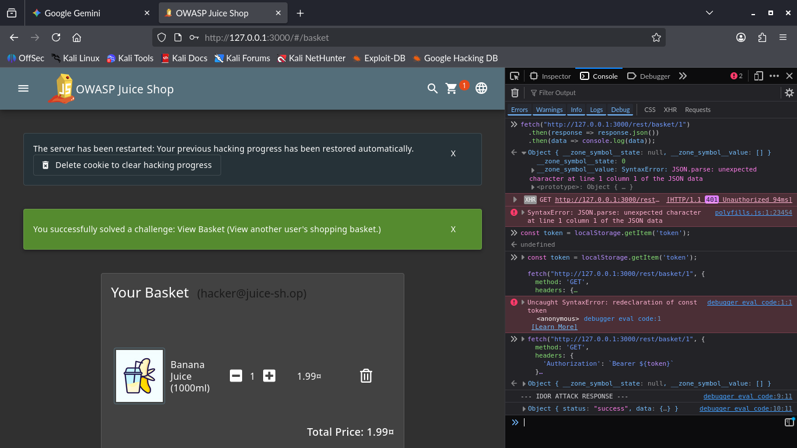

# ADVANCED 05: Insecure Direct Object Reference (IDOR)

## Goal
Access the shopping basket contents of another user (specifically the Administrator's basket) by modifying the resource ID in the request, demonstrating an IDOR flaw.

## Methodology
The initial attempt (direct URL manipulation) failed due to a server-side redirect. The attack pivoted to intercepting and re-crafting the underlying REST API call to bypass the client-side protection.

### Key Steps
1.  **Reconnaissance:** Identified the REST endpoint responsible for fetching basket data: `/rest/basket/:id`.
2.  **Authentication:** Retrieved the current user's valid session token from `localStorage`.
3.  **Exploitation (API Call):** Executed a `fetch` command in the browser console, including the valid token in the `Authorization` header, but substituting the user's basket ID with the target ID **1**.

    * **Target:** `GET /rest/basket/1`

4.  **Confirmation:** The server returned the full JSON object for Basket ID 1.

---

## Key Findings

### 1. Missing Authorization Check
The application logic fails to check if the user associated with the token in the `Authorization` header matches the owner of the `Basket.UserId` specified by the ID in the URL path.

### 2. Information Disclosure
The successful response provided full details of the Administrator's basket contents (ID 1, UserID 1).

### 3. Impact
* **Severity:** **High**
* **Risk:** This vulnerability allows any authenticated user to view the shopping history, item details, and purchase contents of any other user simply by incrementing or decrementing the basket ID. This represents a significant privacy and integrity risk.

---
